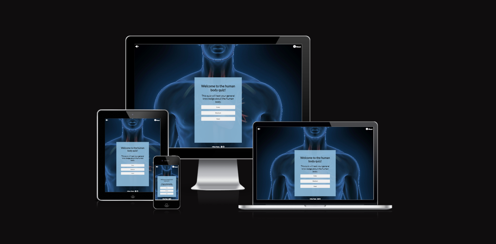
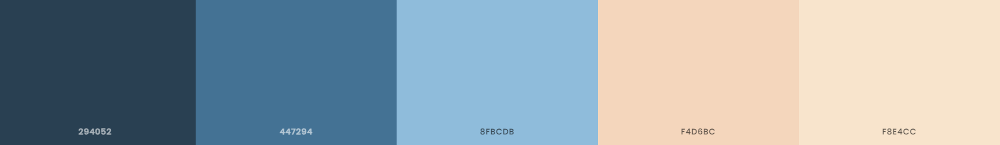
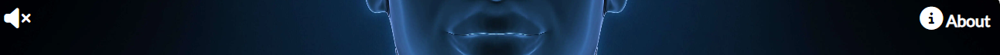
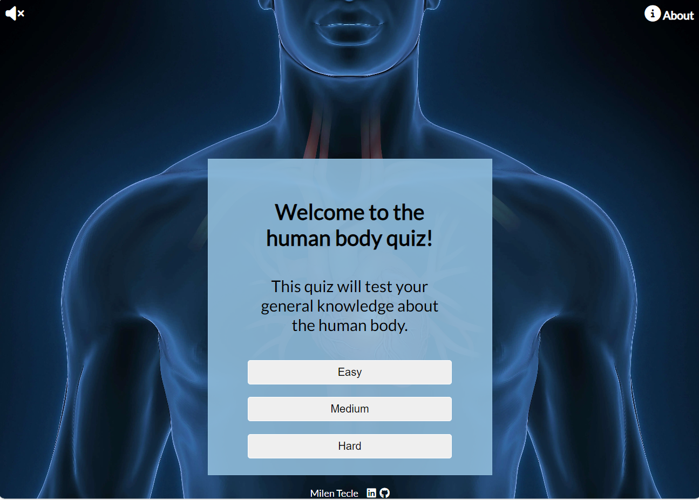
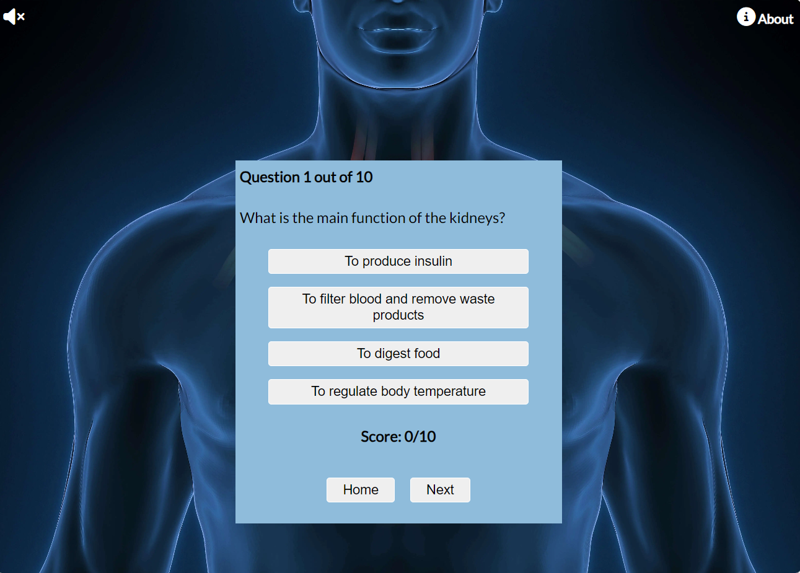
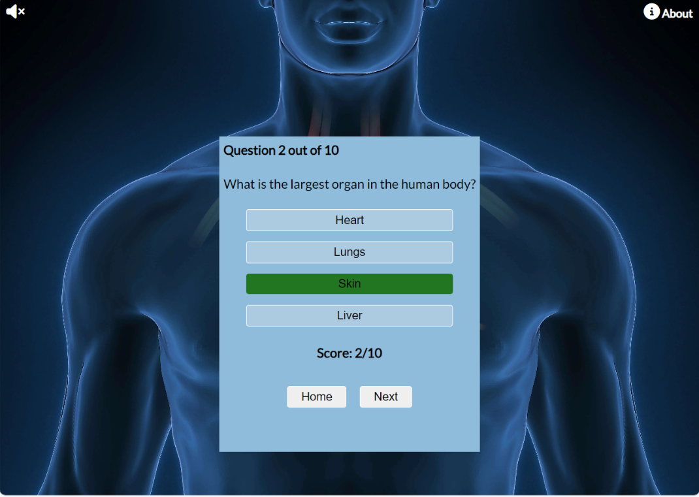
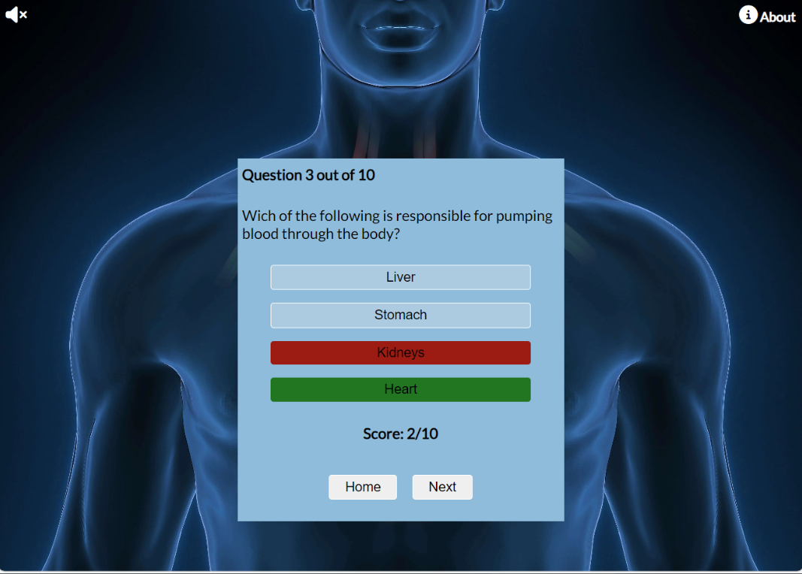
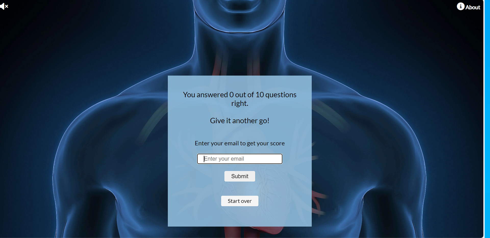

# Human Body Quiz

The human body quiz is a quiz to test the general knowledge of the human body. The purpose of the quiz is to learn in a fun way. The quiz can be played on all screens. The quiz can be used to learn something new or to challenge yourself with different levels of difficulty. The quiz can be played unlimited times, until you have reach the score you aimed for.

The live link can be found here - [Human Body Quiz](https://milentecle.github.io/human-body-quiz/)

## Contents

- [Site Owner Goals](#site-owner-goals)

- [User Stories](#user-stories)
  - [First time user](#first-time-user)

- [Design](#design)
  - [Images](#images)
  - [Colours](#colours)
  - [Fonts](#fonts)
  - [Wireframes](#wireframes)

- [Features](#features)
  - [Navigation](#navigation)
  - [The Home Page](#the-home-page)
  - [Footer](#footer)
  - [The Quiz](#quiz)
  - [End Of Quiz](#end-of-quiz)
  - [Features left to implement](#features-left-to-implement)

- [Technologies used](#technologies-used)

- [Languages](#languages)
- [Frameworks, Libraries and Programs](#frameworks-libraries-programs)
- [Known bugs](#know-bugs)
- [Testing](#testing)

- [Validator Testing](#validator-testing)
  - [HTML](#html)
  - [CSS](#css)
  - [Accessibility](#accessibility)
- [Quiz Testing](#quiz-testing)
  - [Start and play](#start-and-play)
  - [End Of Quiz](#end-of-quiz)
- [Links Testing](#links-testing)
- [Browser Testing](#browser-testing)
- [Device Testing](#device-testing)
- [User Stories Testing](#user-stories-testing)
- [Friends and Family](#friends-and-family)
- [Deployment](#deployment)
- [Credits](#credits)
  - [Code](#code)
  - [Content](#content)
  - [Media](#media)
  - [Acknowledgements](#acknowledgements)

 ## Site Owner Goals

To give the user an oppurtunity to learn about the human body in a fun and easy way. The purpose of the quiz is educational and it is suitable for everyone. To create curiosity and interest in a way that is easy to understand. Challenge a user to try something new, acquire new knowledge and expand knowledge base. To give the user an opportunity to do the quiz on different levels to keep learning. 

## User Stories
- ### First time user
  - As a first time user I want to instantly understand what the quiz is about and how to start the quiz without difficulty.
  - As a first time user I want to be able to choose between different levels; easy, medium and hard.
  - As a first time user I want to be able to play the quiz from different devices.
  - As a first time user I want to be able to track the number of questions.
  - As a first time user I want to get feedback on my score.
  - As a first time user I want to know the correct answer if the answer clicked is wrong, to further learn about the human body.
  - As a first time user I want to have the score result sent to my email.
  - As a first time user I want to be able to restart the quiz without limitations.

- ### Returning User
  - As a returning visitor I already understand the concept and purpose of the quiz.
  - As a returing visitor I have the opportunity to play the quiz as many times as desired.
  - As a returning visitor I can choose to play on different levels, easy, medium and hard to keep learing about the human body.

## Design

### Images
The background image on the site reflects the purpose of the quiz and the appealing image invites the user to further explore the website.

### Colours
The colour scheme used for the website blends well with the background image with a consistent look for the user. The light colour breaks off the blue where needed.

### Fonts
The Lato Font is the font used on the website. The font was imported via [Google Fonts](https//:fonts.google.com). Sans Serif is the backup font.

## Wireframes
The wireframes were produced via Balsamiq.

[Desktop Wireframe](assets/wireframes/Desktop.png) 

[Mobile Wireframe](assets/wireframes/Mobile.png)

## Features
 - ### Navigation

   - The navigation bar is fully responsive with an i-button connected to the about text. Upon click it will display a modal box with instructions for the user. The modal box has an overlay to visually to remove focus from the background.

   - The navigation bar is fixed so it always remains visible for the user.

   - The navigation bar offers a switch to turn the sound on and off. The user will hear a heartbeat sound to create excitment and a connection to the theme of the quiz.

- ### The Home Page 
  - The home page is intuitive and it invites the user to test their knowledge about the human body. 
  - The welcome text is inviting and gives the user a clear perception about the purpose.
  - There are three buttons in connection to the welcome text: Easy, Medium and Hard. The user can play the quiz on different difficulty levels.

 ### Footer
 - The footer contains social media links which takes the user to my LinkedIn profile and my Github repo page for the Human Body Quiz.
 - The links opens in a new tab which allows for the user to navigate easy.

- ### The Quiz
  - When the user clicks on one of the buttons on the start page, the quiz will start. The quiz also has a container, equalent to the the welcome container to maintain recognition for the user.
  - The quiz container will display:
    - The number of the question (1 of 10 upon start)
    - The question itself comes in a random order.
    - Four answer buttons for the user tho choose between.
    - The right answer till display a green background colour.
    - An incorrect answer will display with a red background colour, and the right answer will also be displayed to the user.
    - The answer buttons will be disabled once the user has answered.
    - There is scoreboard that will track the right answers and display it to the user.
    - The quiz will proceed automatically after the user has answered.
    - There is also a next button if the user want to proceed manually or skip a question.
    - A home button is displayed next to the "next" button if the user wants to return to the homepage.

  
  
  

- ### End Of Quiz
  - When the user has finished the quiz after 10 questions, they  will be presented with their score. Depending on the number of right answers, the user will be displayed with different text. 
  - A score between 0-5 will display the text: "Give it another go!".
  - A score between 6-8 will display the text: "Nicely done!".
  - A score between 9-10 will display the text: "Excellent job!"
  - The user will also have the oppurtunity to enter their email and get the score result sent to ther email adress. An alert message will display to show the user wether the email was sent or not.
  - The user can click on the "Start over" button to go back to the home page and choose the same, or another difficulty level.

### Features left to implement
  - A highscore board where the user can save their score and follow their own progress.

## Technologies used

## Languages 
  - HTML5
  - CSS
  - Javascript

  ## Frameworks, Libraries and Programs
   - [Am I Responsive](https://ui.dev/amiresponsive) - Was used to ensure that the website is responsive on diffrerent devices.
   - [Balsamiq](https://balsamiq.com/) - Was used to create the wireframes before starting the project.
   - [Chrome Dev Tools](https://developer.chrome.com/docs/devtools/) - Was used on a daily basis throughout the project to make changes and to test the responsivness.
   - [EmailJS](https://www.emailjs.com/) - Was used to create a template and send email to user with the score.
   - [Font Awesome](https://fontawesome.com/) - Was used for Social Media icons in footer and for Contact information on the contact page.
   - [Gitpod](https://gitpod.io/) - Was the Codespace used for this project.
   - [Git](https://git-scm.com/) - Git was used for version control by using the Gitpod terminal to commit and then push to Github.
   - [Github](https://github.com/) - Is where the projects code is stored after being pushed. 
   - [Google Fonts](https://fonts.google.com/) - Was used to import fonts to the page.
   - [Responsinator](http://www.responsinator.com/) - Was also used to ensure that the website is responsive on diffrerent devices.
   - [TinyPNG](https://tinypng.com/) - Was used to reduce the file size and keep the image quality.
   - [WEBP Converter](https://cloudconvert.com/webp-converter) - Also used to reduce the file size and keep the image quality.
   - [W3C](https://www.w3.org/) - Was used for HTML and CSS Validation.
   - [Web Formatter](https://webformatter.com/html) - Was used to make sure the format looks good.
   - [JS-hint](https://jshint.com/) - Was used for Javascript Validation.

## Known bugs
No known bugs.

## Testing

### Validator Testing
 - ### HTML
    - No errors were returned when running the page of the code through the [W3C Markup Validator](https://validator.w3.org/)
     - [W3C Markup Validator Results](assets/test-results/w3c-css-validator-result.png)
 - ### CSS
  - No errors were returned when running the CSS through the [W3C CSS Validator](https://jigsaw.w3.org/css-validator)
     - [W3C CSS Validator Results](assets/test-results/w3c-css-validator-result.png)

 - ### JS Hint
  - No errors were returned when running the Javascript code through [JS Hint](https://jshint.com/)
    - [JS Hint result](assets/test-results/js-hint-result.png)

 - ### Accessibility
  - The site achieved a Lighthouse accessibility score of 100%, a confirmation that the fonts and colours chosen are accessible and easy to read.
    - [Lighthouse result](assets/test-results/lighthouse-result.png)

### Quiz Testing
 - ### Start and play 
    - That the buttons, easy, medium and hard will start the quiz has been tested to make sure they work properly.
    - The functionality that the buttons will lead to the right difficulty questions when clicking on one of the buttons to start the quiz has been tested.
    - That the questions are presented in a randomized order has been tested.
    - That the right answer will display a green background colour, the incorrect with a red background colour and the right answer till be displayed if user's answer is wrong has all been tested.
    - That the answer buttons disables after the user has chosen an answer to ensure that the user can't change the answer has been tested.
    - That the number of question and which question the user is on is displaying has been tested.
    - That the score count is adding points upon correct answer and is being displayed to the user has been tested.
    - When the user has answered, there's a short delay so the user can see the answer before moving on to next question automatically has been tested.
    - That the buttons home and next are working as intended has been tested.

  - ### End Of Quiz
    - That the user will be presented with the total score, number of right answers has been tested.
    - That the user is getting the right feedback text depening on the number of correct answers has been tested.
    - That the user can enter their email address to get their score result sent to their email and email validation has been tested.
    - That the submit button is working properly and the user gets a confirmation with an alert message that the email has been sent has been tested.
    - That the start over button takes the user back to the home page has been tested.

### Links Testing
 - All navigation links on the site has been tested manually to ensure that they are working, and takes the user to the right page.
 - All the buttons were tested to ensure that the the links are working correctly.
 - The social media links were tested separately to make sure they function, and opens in a new tab.

### Browser Testing
 - The Website was tested on Microsoft Edge, Google Chrome, Firefox and Safari browsers and no issues were noted.

### Device Testing
  - The website was tested and on different devices such as: Iphone 8, Iphone mini 12 and Pro, Samsung Galaxy S21, Samsung Galaxy Tab S6 lite, Ipad Mini, Laptop and Desktop to see that the website is responsive on different devices. Chrome developer tools was used to test and to check the responsivness on multiple devices. 
  - I also used the following websites to test the responsivness:
  - [Responsinator](http://www.responsinator.com/?url=https%3A%2F%2Fmilentecle.github.io%2Fhuman-body-quiz%2F)
  - [Am I responsive](https://ui.dev/amiresponsive?url=https://milentecle.github.io/human-body-quiz/)

### User Stories Testing
   #### First time user
 1. The home page with the welcome container will tell the user what the quiz is about. The user can start the quiz immediately without difficulty by clicking one of the buttons in the welcome contaner, or click on "about" to get more information about the quiz.
 2. As a user I can choose between different levels; easy, medium and hard by clicking on one of the buttons.
 3. As a user I can play the quiz from my mobile, laptop, desktop and tablet.
 4. As a user I can see which question I am at and how many questions there are once I have started to play the quiz.
 5. As a first time user I can track my score and see how many answers I am getting right while playing.
 6. As a first time user I will get instant feedback if my answer is wrong with a red background colour, and by seeing the right answer with the background colour of green.
 7. As a first time user I can enter my email address when the quiz has ended, and get the score result sent to my email.
 8. As a first time user I can retake the quiz by clickning on the "Start over" button which will take me back to the home page.

   #### Returning user
 1. As a returning I am already familiar with the structure of the quiz and how to navigate through the quiz.
 2. As a returing I can retake the quiz as many times as desired without any limitations and the questions will not always be the same.
 3. As a returning visitor I can choose to play on different levels, easy, medium and hard to keep learing about the human body.

  ## Friends and Family
   - Family members and friends were asked to test the website for bugs and overall experience.

## Deployment

The project was deployed using Github pages with the following steps:
1. Go to the repository on Github.com.
2. Select 'Settings' towards the top of the page.
3. Select 'Pages' from the left menu bar.
4. Under 'Source', choose the preselected 'Branch' from the dropdown menu and then select the main branch.
5. Deployment is confirmed after a couple of minutes by the following message "Your site is published at" and there is a link to the web address.

The live link can be found here - [The Human Body Quiz](https://milentecle.github.io/human-body-quiz/)

## Credits

### Code
 - I used code from here to create the playSound function: 
   - [Stackoverflow play sound on click](https://stackoverflow.com/questions/33663740/play-sound-and-change-play-icon-to-stop-icon-on-click)
   - [Stackoverflow stop sound](https://stackoverflow.com/questions/33671577/click-in-icon-play-to-start-sound-then-click-stop-icon-to-stop-sound)
   - [Dev](https://dev.to/shantanu_jana/how-to-play-sound-on-button-click-in-javascript-3m48)
 
 - I used some of this code to create a modal box and to make it work accordingly: 
   - [w3schools](https://www.w3schools.com/howto/howto_css_modals.asp)
 
 - I used code from this video to accurately create the answer buttons and to create the text found in my PresentQuestions function. I also used code from the same video to reset the answers with a while loop, found in my resetAnswers function: 
   - [Youtube](https://www.youtube.com/watch?v=PBcqGxrr9g8)

 - I used code from this video to sort the questions in a randomized order with the sort method. I also used code from the same video to connect right and wrong answers to the corresponing answer buttons.
   - [Youtube](https://www.youtube.com/watch?v=riDzcEQbX6k)

 - I used these as inspiration to better understand how to use existing code when connecting the logic for the difficulty buttons and questions: 
    - [Stackoverflow use same methods new objects](https://stackoverflow.com/questions/52210163/how-to-generate-new-object-while-using-the-same-methods)
    - [Stackoverflow different levels](https://stackoverflow.com/questions/53766944/simple-quiz-with-different-levels-divs)
    - [Stackoverflow different questions](https://stackoverflow.com/questions/55855497/how-to-create-a-quiz-that-has-different-questions-on-different-pages)

 - I used this to better understand how to disable the answer buttons: 
   - [Alvarotrigo](https://alvarotrigo.com/blog/disable-button-javascript/)

 - I used parts of this code to create the overlay effect: 
   - [w3schools](https://www.w3schools.com/howto/howto_css_overlay.asp)

 - I used these guides to setup the functionality for EmailJS along with quidance from my mentor:
   - [EmailJS](https://www.emailjs.com/docs/sdk/send/)
   - [Mailtrap](https://mailtrap.io/blog/javascript-send-email/)
   - [Stackoverflow](https://stackoverflow.com/questions/58791656/send-email-directly-from-javascript-using-emailjs)

- I used these guides to understand how to push footer down without using fixed position:
  - [Stackoverflow](https://stackoverflow.com/questions/55541850/how-to-make-footer-stay-at-bottom-of-the-page-with-flex-box)
  - [MDN Web Docs](https://developer.mozilla.org/en-US/docs/Web/CSS/CSS_flexible_box_layout/Mastering_wrapping_of_flex_items)

- I used these videos in general to understand the full concept of creating a quiz:
   - [Youtube](https://www.youtube.com/watch?v=PBcqGxrr9g8)
   - [Youtube](https://www.youtube.com/watch?v=riDzcEQbX6k)
   - [Youtube](https://www.youtube.com/watch?v=_LYxkClHnV0)
   - [Shecodes](https://www.shecodes.io/athena/59004-how-to-create-a-standard-quiz-with-html-css-and-javascript)
   - [Stackoverflow](https://stackoverflow.com/questions/75575841/how-can-i-initiate-a-quiz-by-clicking-on-a-button-in-javascript)
   - [Dev](https://dev.to/sulaimonolaniran/building-a-simple-quiz-with-html-css-and-javascript-4elp)
 

### Content
The content besides the questions were written by the developer. The majority of the quiz questions were generated from:
 - [ChatGPT](https://chat.openai.com/auth/login)
 - [Anatomy test](https://www.aama-ntl.org/cma-aama-exam/study/anatomy-physiology-practice-test)

### Media
Images were taken from:
 - [Shutterstock](https://www.shutterstock.com/)

 Audio was taken from:
 - [Quicksounds](https://quicksounds.com/library/sounds/heartbeat)

### Acknowledgements
- Antonio, my mentor, for guiding med throughout the project with important suggestions to improve the quiz and funcionality.
- To my husband and family, for all the support and patience throughout this project.